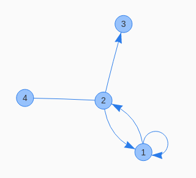

# vis-component

A wrapped [vis.js](http://visjs.org/) network module web-component.

## Usage

Install the component via [Bower](http://bower.io/):

    bower i vis-component -S

Import the component:

    <link rel="import" href="../bower_components/vis-component.html">

Use it:

    <vis-component dotcontent="dinetwork {1 -> 1 -> 2; 2 -> 3; 2 -- 4; 2 -> 1 }"></vis-component>

